Cyclistic Data Analysis Report
================
By Dante Imerito
2023-09-03

## About this project
This project served as my capstone study for the Google Data Analytics Professional Certificate course which I completed in September of 2023. The subject of this study is a company called Cyclistic, which owns and operates hundreds of bicycle rental stations throughout the city of Chicago, IL.

Cyclistic is trying to grow their business by developing a marketing strategy that will convert casual riders into annual members. One key distinction between annual members and casual riders is that annual members have purchased a yearly subscription to Cyclistic's services while casual riders pay on a per-ride or daily basis.

The data provided for analysis includes 1 year of bicycle trip data spanning the months of July 2022 through June 2023. Station location information was also sourced from the City of Chicago Data Portal as well as through the use of online maps.

I welcome you to explore my findings below.

Thanks,
Dante Imerito

## Business Task

To increase company revenue by developing a marketing strategy that will
convert Cyclistic’s casual riders into annual members.

## Goal of Analysis

To identify key trends and insights into how Cyclistic members and
casual riders use Cyclistic bikes differently.

## Data Sources

One year of Cyclistic’s bicycle user data has been provided for
analysis. This data was provided in the form of twelve individual CSV
files. Each file represents one month of user data spanning from July
2022 through June 2023.  
**Source:** <https://divvy-tripdata.s3.amazonaws.com/index.html>

Bicycle station location data was obtained through the City of Chicago
Data Portal. This data set claims to include the GPS coordinates of all
Divvy (Cyclistic) bicycle stations in the City of Chicago.  
**Source:**
<https://data.cityofchicago.org/Transportation/Divvy-Bicycle-Stations/bbyy-e7gq/data>

Additional station location data was verified and compiled manually for
stations that exist in Cyclistic’s trip data but did not exist in the
public listing of station locations obtained from the City of Chicago
Data Portal.  
**Source:** data/stations_additional/stations_additional.csv

## Load R Packages

``` r
library(tidyverse) # for many data analysis tools
library(scales) # for modifying units of measure
library(sf) # for working with geospatial data & maps
library(ggmap) # for more detailed background maps
library(plotly) # for better visualization of maps
library(osmdata) # for working with openstreetmap.org
library(janitor) # for cleaning data
library(ggthemes) # for more themes (including theme_map())
```

## Set Color Variables

``` r
color_member <- "#00204D"
color_casual <- "#6699FF"
```

# Cleaning & Manipulation of Data

``` r
# Load the past 12 months of Cyclistic's historical data into data frames
july <- read.csv("data/202207-divvy-tripdata.csv")
august <- read.csv("data/202208-divvy-tripdata.csv")
september <- read.csv("data/202209-divvy-publictripdata.csv")
october <- read.csv("data/202210-divvy-tripdata.csv")
november <- read.csv("data/202211-divvy-tripdata.csv")
december <- read.csv("data/202212-divvy-tripdata.csv")
january <- read.csv("data/202301-divvy-tripdata.csv")
february <- read.csv("data/202302-divvy-tripdata.csv")
march <- read.csv("data/202303-divvy-tripdata.csv")
april <- read.csv("data/202304-divvy-tripdata.csv")
may <- read.csv("data/202305-divvy-tripdata.csv")
june <- read.csv("data/202306-divvy-tripdata.csv")


# Combine the 12 historical data frames (months) into a single data frame (year)
data <- rbind(july, august, september, october, november, december, january, february, march, april, may, june)


# Create a dataframe of the unmodified data set
data_unclean <- data


# Remove month variables from environment now that bind is complete
rm(january, february, march, april, may, june, july, august, september, october, november, december)


# Check for duplicate ride_id's
has_duplicates <- length(data$ride_id) != length(unique(data$ride_id))
print(has_duplicates)
```

    ## [1] FALSE

``` r
# Check for NA values
na_counts <- colSums(is.na(data))
print(na_counts)
```

    ##            ride_id      rideable_type         started_at           ended_at 
    ##                  0                  0                  0                  0 
    ## start_station_name   start_station_id   end_station_name     end_station_id 
    ##                  0                  0                  0                  0 
    ##          start_lat          start_lng            end_lat            end_lng 
    ##                  0                  0               5795               5795 
    ##      member_casual 
    ##                  0

``` r
# Drop rows with missing ending coordinates (these show excessive ride time)
data <- data %>% drop_na(c(end_lat, end_lng))


# Check for empty string values
char_vars <- data %>% 
select_if(is.character)

empty_strings <- function(vec) {
  sum(vec == "", na.rm = TRUE)
}
sum_empty_strings <- sapply(char_vars, empty_strings)
print(sum_empty_strings)
```

    ##            ride_id      rideable_type         started_at           ended_at 
    ##                  0                  0                  0                  0 
    ## start_station_name   start_station_id   end_station_name     end_station_id 
    ##             857860             857992             909870             910011 
    ##      member_casual 
    ##                  0

``` r
# Convert empty strings and zero values to NA
data$start_station_name[data$start_station_name == ""] = NA
data$end_station_name[data$end_station_name == ""] = NA
data$start_station_id[data$start_station_id == ""] = NA
data$end_station_id[data$end_station_id == ""] = NA
data$end_lat[data$end_lat == 0] = NA
data$end_lng[data$end_lng == 0] = NA


# Trim excess whitespace from strings
data$start_station_name <- trimws(gsub("\\s+", " ", data$start_station_name))
data$end_station_name <- trimws(gsub("\\s+", " ", data$end_station_name))
data$start_station_id <- trimws(gsub("\\s+", " ", data$start_station_id))
data$end_station_id <- trimws(gsub("\\s+", " ", data$end_station_id))
data$ride_id <- trimws(gsub("\\s+", " ", data$ride_id))
data$rideable_type <- trimws(gsub("\\s+", " ", data$rideable_type))


# Drop rows if start time is later than end time (impossible scenario)
data <- data %>% filter(!started_at >= ended_at)


# Convert started_at and ended_at columns to datetime format
data <- mutate(data, started_at = ymd_hms(started_at))
data <- mutate(data, ended_at = ymd_hms(ended_at))


# Remove underscore in rideable_type column values and convert to title case
data$rideable_type <- str_to_title(str_replace(data$rideable_type, "_", " "))


# Remove &amp; in stations columns
data$start_station_name <- str_replace(data$start_station_name, "&amp;", "&")
data$start_station_name <- str_replace(data$start_station_name, "&amp;", "&")


# Convert member_casual column to title case
data$member_casual <- str_to_title(data$member_casual)


# Create ride_length column and convert to minutes
data <- mutate(data, ride_length = round(difftime(ended_at, started_at, units  = "mins"), digits = 2))


# Remove rows with ride_length less than 1 minute
# This helps exclude observations of "false rides" (i.e. someone is un-docking and immediately re-docking the bike)
data <- filter(data, ride_length >= 1.00)


# Create a column for day of week that the ride started
data <- mutate(data, day_of_week = weekdays(started_at, abbreviate = F))


# Create column for month that the ride started
data <- mutate(data, month = month(started_at, label = T))


# Create a function to determine the phase of day
day_phase <- function(time) {
  hr <- lubridate::hour(time)
  dplyr::case_when(hr > 5 & hr < 12 ~ 'Morning',
                   hr >= 12 & hr < 18 ~ 'Afternoon',
                   hr >=  18 & hr <= 23 ~ 'Evening',
                   TRUE ~ 'Night')
}

# Create phase_of_day column
data <- mutate(data, phase_of_day = day_phase(started_at))


# import City of Chicago's bicycle station location list 
stations_divvy <- read.csv("data/bike-stations_city-of-chicago/Divvy_Bicycle_Stations_-_All_-_Map.csv")
stations_divvy <- stations_divvy %>% select(Station.Name, Latitude, Longitude)


# import additional station location data
stations_additional <- read.csv("data/stations_additional/stations_additional.csv")


# combine station lists
stations <- rbind(stations_divvy, stations_additional)


# Trim white space
stations$Station.Name <- trimws(gsub("\\s+", " ", stations$Station.Name))


# Create start_stations data frame & rename variables (for future join)
start_stations <- stations %>%
  rename(start_station_name = Station.Name,
         start_station_lat = Latitude,
         start_station_lng = Longitude)


# Create end_stations data frame & rename variables (for future join)
end_stations <- stations %>%
  rename(end_station_name = Station.Name,
         end_station_lat = Latitude,
         end_station_lng = Longitude)


# Join station data with main data set
data <- left_join(data, start_stations)
```

    ## Joining with `by = join_by(start_station_name)`

``` r
data <- left_join(data, end_stations)
```

    ## Joining with `by = join_by(end_station_name)`

``` r
# Remove end_stations and start_stations data sets from environment now that join is complete
rm(start_stations, end_stations)
```

# Issues with the data

## Missing start station names and/or end station names

The presented data shows over 1.3 million rides, roughly 23%, that do
not include a start station name or end station name. These observations
will not be included in the portions of this analysis involving station
names or station location. However, in an effort to use as much of the
data as possible, other variables from these observations will still be
utilized. For example, average ride length, a statistic that isn’t
relevant to station name or station location, will be calculated using
these incomplete observations.

``` r
data %>%
  select(start_station_name, end_station_name) %>% 
  filter(is.na(start_station_name) | is.na(end_station_name)) %>%
  summarise(
    rides = n()
  )
```

    ##     rides
    ## 1 1305944

## Truncated coordinates

Over 1.4 million rides (about 25% of the data set) contain truncated
geographic coordinates. These truncations shorten the numeric
representing latitude and/or longitude from 5 or more decimal places to
2 decimal places. For example, a latitude of 41.91964 may be represented
as 41.91, thus reducing the accuracy of the station location on maps by
several city blocks.

``` r
# Rides with truncated coordinates
data %>% 
  select(start_station_name, start_lat, start_lng, end_station_name, end_lat, end_lng) %>% 
  filter(
    (nchar(start_lat) <= 5 & nchar(start_lng) <=6) |
    (nchar(end_lat) <= 5 & nchar(end_lng) <=6)
  ) %>%
  summarise(
    truncated_rides = n()
  )
```

    ##   truncated_rides
    ## 1         1403674

A wide majority of coordinate truncations occur on electric bikes.

``` r
# Quantity of truncated coordinates by bicycle type
data %>% 
  filter(
    (nchar(start_lat) <= 5 & nchar(start_lng) <=6) |
    (nchar(end_lat) <= 5 & nchar(end_lng) <=6)
  ) %>% 
  group_by(rideable_type) %>% 
  summarise(rides = n())
```

    ## # A tibble: 2 × 2
    ##   rideable_type   rides
    ##   <chr>           <int>
    ## 1 Classic Bike     3573
    ## 2 Electric Bike 1400101

## Map of truncated coordinates

The truncated coordinates appear in a perfect grid when viewed over a
map of the Chicago area.

``` r
# starting coordinates
trunc_coords_start <- data %>%
  select(start_lat, start_lng) %>% 
  filter((nchar(start_lat) <= 5 & nchar(start_lng) <=6)) %>% 
  group_by(start_lat, start_lng) %>% 
  summarise(n = n(), .groups = 'drop')

# ending coordinates
trunc_coords_end <- data %>% 
  select(end_lat, end_lng) %>% 
  filter((nchar(end_lat) <= 5 & nchar(end_lng) <=6)) %>%
  group_by(end_lat, end_lng) %>% 
  summarise(n = n(), .groups = 'drop')

# Set bounding box & import map
bbox = c(top = 42.1196, right = -87.3097, bottom = 41.5672, left = -88.1007)
import_map <- get_map(bbox, maptype = "terrain", source = "stamen", zoom = 10)

# plot truncated coordinates on map
ggmap(import_map) +
  geom_point(data = trunc_coords_start, mapping = aes(x = start_lng, y = start_lat), size = 0.5, color = "navyblue") +
  geom_point(data = trunc_coords_end, mapping = aes(x = end_lng, y = end_lat), size = 0.5, color = "navyblue") +
   scale_color_distiller(palette = 1, direction = 1) +
  labs(title = "Truncated station coordinates", subtitle = "Present for over 1.4M rides", caption = "" ) +
  theme_map()
  ggsave("img/truncated-coords-2.png")
```

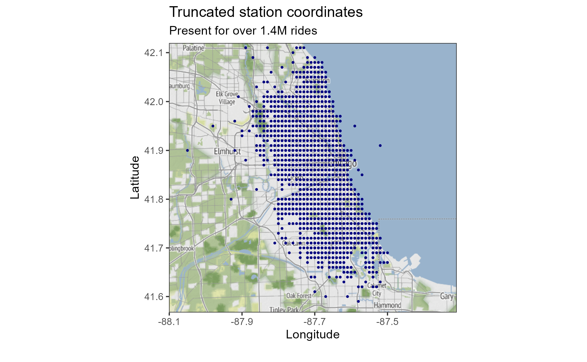

## Map of inaccurate station coordinates

In many cases the coordinates provided for individual station names
appear to be misplaced when plotted on a map of Chicago. This issue, in
conjunction with the truncated station data, calls the reliability of
the provided station coordinates into question. Below is a visualization
of the geographic coordinates provided for rides that started at
“Streeter Dr & Grand Ave”.

``` r
start_coordinates <- data %>% 
  select(start_station_name, start_lat, start_lng) %>% 
  filter(start_station_name == "Streeter Dr & Grand Ave")

bbox = c(top = 42.1196, right = -87.3097, bottom = 41.5672, left = -88.1007)
import_map <- get_map(bbox, maptype = "terrain", source = "stamen", zoom = 10)

ggmap(import_map) +
  geom_point(data = start_coordinates, mapping = aes(x = start_lng, y = start_lat), color = "darkred", alpha = 0.45) +
  labs(x = "Longitude", y = "Latitude", title = "Inaccurate station coordinates", subtitle = "Streeter Dr & Grand Ave", caption = "") + 
  theme_bw() +
  theme(plot.title = element_text(size = 13.5))
  ggsave("img/innacurate-coords-2.png")
```

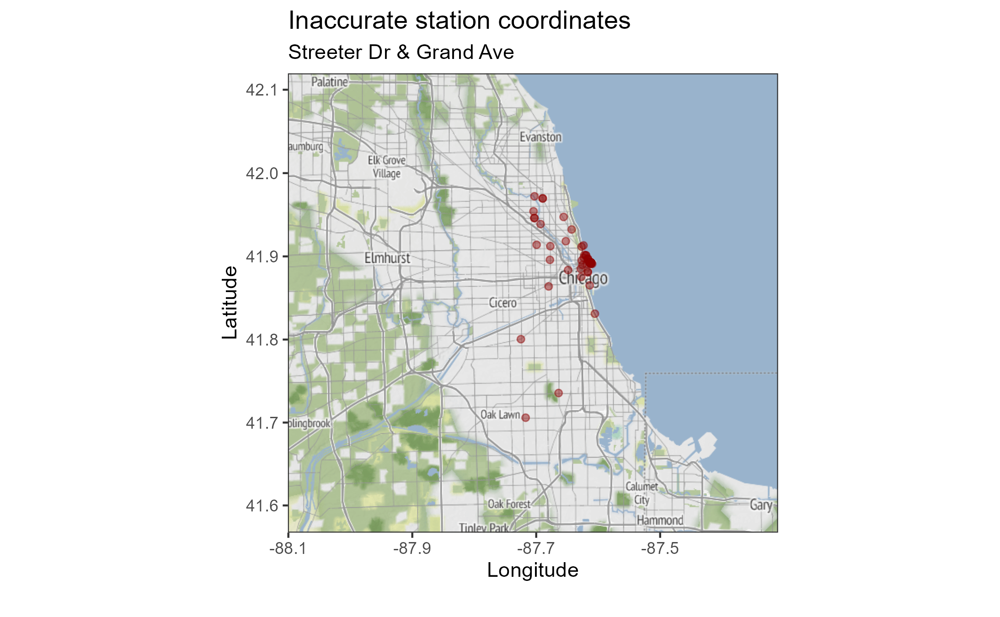

## Publicly available station listing

Because these inaccuracies constitute such a large portion of the
Cyclistic data set, station coordinates have instead been referenced
from the Chicago Data Portal’s listing of Divvy (Cyclistic) bike station
locations, which provides the latitude and longitude of each bicycle
station.

``` r
bbox = c(top = 42.1196, right = -87.3097, bottom = 41.5672, left = -88.1007)
import_map <- get_map(bbox, maptype = "terrain", source = "stamen", zoom = 10)

ggmap(import_map) +
  geom_point(data = stations_divvy, mapping = aes(x = Longitude, y = Latitude), size = 0.5, color = "darkgreen", alpha = 0.75) +
  labs(x = "Longitude", y = "Latitude", title = "Publicly available station listing", caption = "Data provided by Chicago Data Portal") +
  theme_bw()
  ggsave("img/divvy-listing-2.png")
```

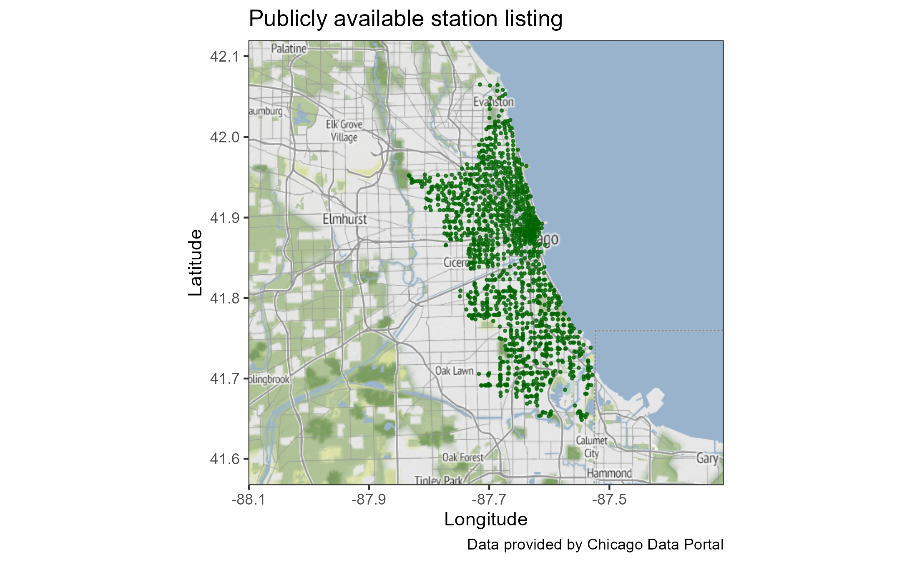

There are several stations that are not listed in Chicago’s Data Portal
but do exist in the Cyclistic ride share data. These additional stations
and coordinates have been verified and compiled manually by comparing
stations names and coordinates from each list as well as through the use
of online maps. The coordinates of these additional stations will also
be used to reference station location throughout this study.

## Corrected coordinates

As you can see below, the coordinates for the “Streeter Dr & Grand Ave”
station are all located in the same place when the new coordinate
references are utilized.

``` r
coordinates <- data %>% filter(start_station_name == "Streeter Dr & Grand Ave")

bbox = c(top = 42.1196, right = -87.3097, bottom = 41.5672, left = -88.1007)
import_map <- get_map(bbox, maptype = "terrain", source = "stamen", zoom = 10)

ggmap(import_map) +
  geom_point(data = coordinates, mapping = aes(x = start_station_lng, y = start_station_lat), color = "darkred", alpha = 0.45) +
  labs(x="Longitude", y="Latitude",title = "Corrected station coordinates", subtitle = "Streeter Dr & Grand Ave", caption = "") + 
  theme_bw() +
  theme(plot.title = element_text(size = 13.5))
  ggsave("img/corrected-coords-2.png")
```

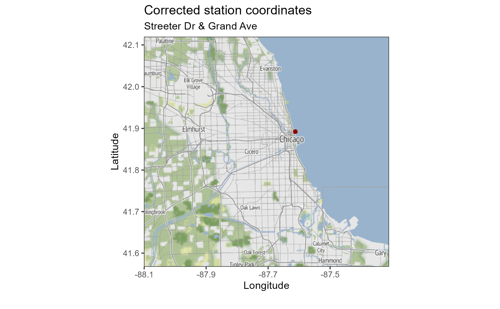

# Summary of Analysis

## Total rides

Casual rides constitute roughly 36% of all rides. Member rides
constitute about 64%.

``` r
data %>% 
  group_by(member_casual) %>% 
  summarise(n = n()) %>% 
  ggplot() +
    aes(x = member_casual, y = n, fill = member_casual) +
    geom_bar(position='dodge', stat='identity') +
    scale_y_continuous(label = label_number(scale_cut = cut_short_scale())) +
    scale_fill_manual(values = c(Casual = color_casual, Member = color_member)) +
    geom_text(aes(label = format(n, big.mark = ",")), vjust = -0.5, size = 3.5, position = position_dodge(0.9)) +
    labs(x = "", y = "Rides", title = "Total rides") +
    theme_classic() +
    theme(legend.position = "none")
    ggsave("img/total-rides.png")
```

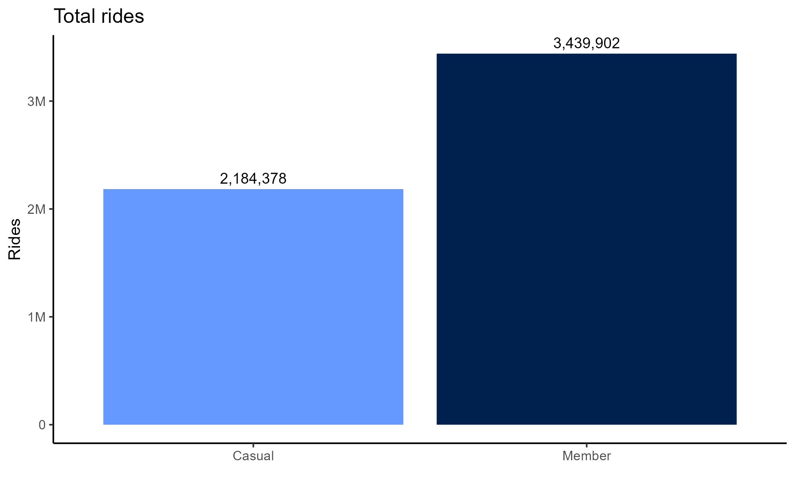

## Average ride length

Casual riders tend to ride more than eight minutes longer than the
average member.

``` r
data %>% 
  group_by(member_casual) %>%
  summarise(avg_ride_length = mean(as.numeric(ride_length), na.rm=T)) %>% 
  ggplot() +
  aes(x = member_casual, y = avg_ride_length, fill = member_casual) +
  geom_bar(position='dodge', stat='identity') +
  scale_fill_manual(values = c(Casual = color_casual, Member = color_member)) +
  geom_text(aes(label = round(avg_ride_length, 1)), vjust = -0.5, size = 3.5, position = position_dodge(0.9)) +
  labs(x = "", y = "Average Ride Length (Mins)", title = "Average Ride Length (Minutes)", subtitle = "") +
  theme_classic() +
  theme(legend.position = "none")
  ggsave("img/avg-ride-length.png")
```

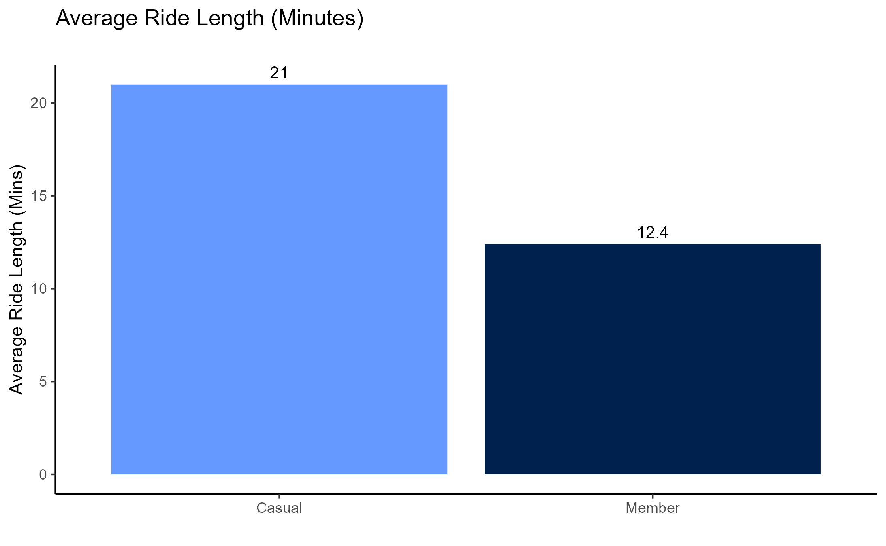

## Rides by bike type

The data shows that both casuals and members ride electric bikes more
often than classic bikes.

``` r
data %>% 
  drop_na(rideable_type, member_casual) %>% 
  group_by(rideable_type, member_casual) %>% 
  summarize(quantity = n(), .groups = 'drop') %>% 
  ggplot() +
    aes(x = rideable_type, y = quantity, fill = member_casual) +
    geom_bar(position='dodge', stat='identity') +
    scale_y_continuous(label = label_number(scale_cut = cut_short_scale())) +
    scale_fill_manual(values = c(Casual = color_casual, Member = color_member)) +
    labs(x = "", y = "Rides", title = "Rides by bike type") +
    theme_classic() +
    theme(legend.title = element_blank()) 
    ggsave("img/rides-by-bike-type.png")
```

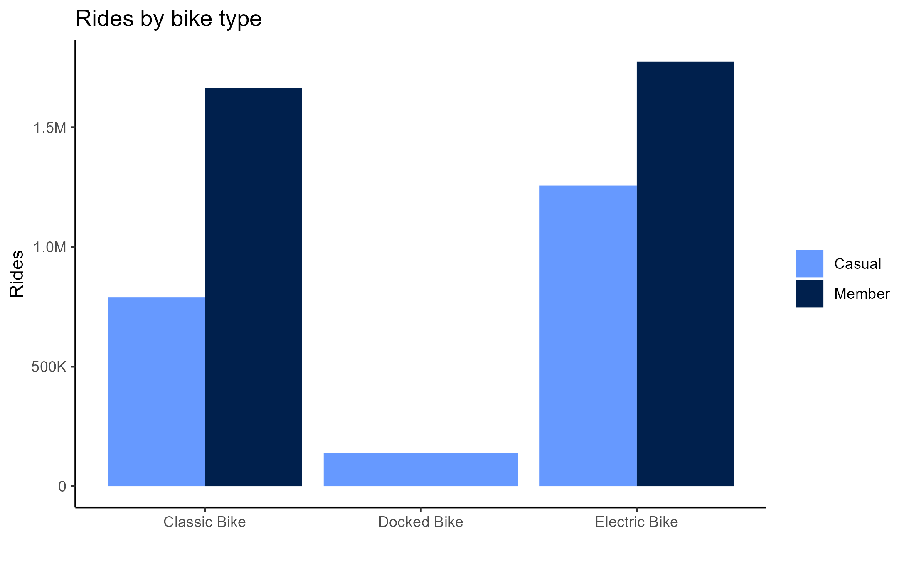

## Docked bikes

The data set includes three possible values for the “rideable_type”
variable: electric bike, classic bike or docked bike. The “docked bike”
value is included in 138,910 observations and should be discussed with
Cyclistic’s technical team in order to better understand what this data
represents.

## Average Ride Length by Bike type

While the “docked bike” designation is unique to Casual riders. The
average ride length for docked bikes is notably higher than the average
of electric or classic bikes. Docked bikes aside, we see the longest
rides on average being taken by casuals on classic bikes.

``` r
data %>% 
  drop_na(rideable_type, member_casual) %>% 
  group_by(rideable_type, member_casual) %>%
  summarise(avg_ride = mean(as.numeric(ride_length), na.rm = T), .groups = 'drop') %>% 
  ggplot() +
    aes(x = rideable_type, y = avg_ride, fill = member_casual) +
    geom_bar(position='dodge', stat='identity') +
    scale_fill_manual(values = c(Casual = color_casual, Member = color_member)) +
    geom_text(aes(label = round(avg_ride, 1)), vjust = -0.5, size = 3.5, position = position_dodge(0.9)) +
    labs(x = "", y = "Average Ride Length (Minutes)", title = "Average ride length by bike type", subtitle = "") + 
    theme_classic() +
    theme(legend.title = element_blank())
    ggsave("img/avg-ride-length-by-bike-type.png")
```

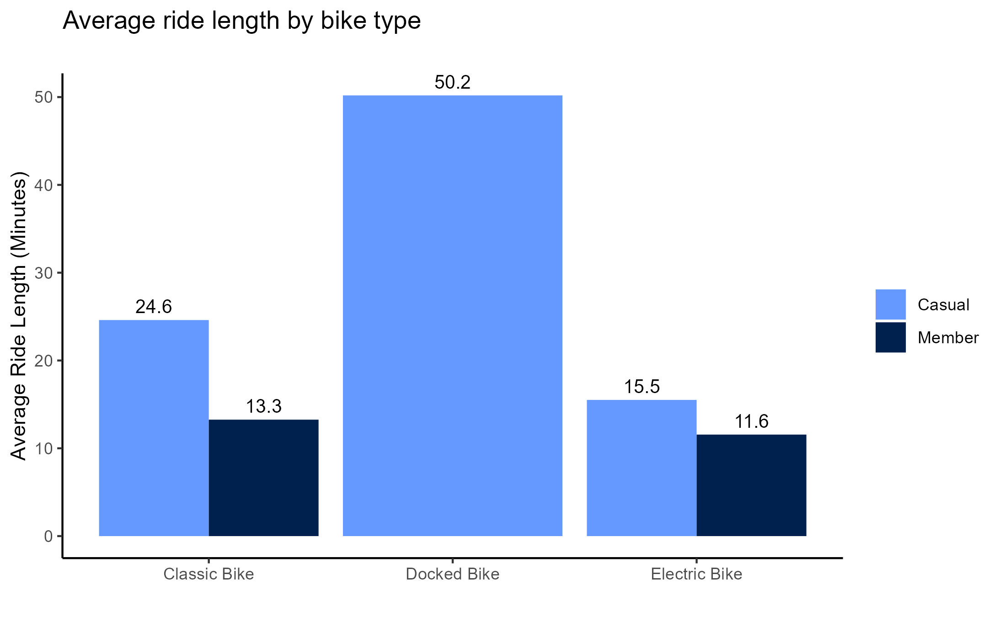

## Rides per month

A look at ride quantity on a monthly basis shows that ridership for both
members and casuals follows a similar pattern. Both groups ride more
often during the warmer summer months versus the colder winter months.
However, casual riders exhibit a greater degree of seasonal fluctuation
as they account for just a small fraction of rides during the winter
months while riding much more often during the summer and nearly as much
as members during the month of July.

``` r
data %>% 
ggplot() +
 aes(x = factor(month, level=c('Jan', 'Feb', 'Mar', 'Apr', 'May', 'Jun', 'Jul', 'Aug', 'Sep', 'Oct', 'Nov', 'Dec')), fill = member_casual) +
 geom_bar(position = "dodge") +
 scale_y_continuous(label = label_number(scale_cut = cut_short_scale())) +
 scale_fill_manual(values = c(Casual = color_casual, Member = color_member)) +
 labs(x = "", y = "Rides", title = "Rides per month", subtitle = "") +
  theme_classic() +
  theme(legend.title = element_blank())
  ggsave("img/rides-per-month.png")
```

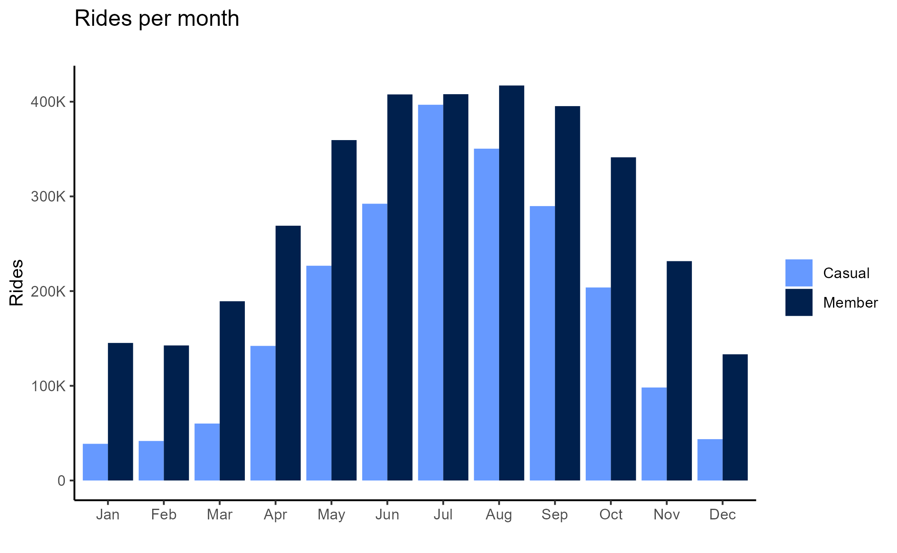

## Rides by Day of week

Members tend to ride most often during the middle of the work week (Tue,
Wed, Thurs), while casual riders are partial to the the weekend with
Friday, Saturday and Sunday as the most popular days to ride.

``` r
ggplot(data) +
  aes(x = factor(day_of_week, level=c('Monday', 'Tuesday', 'Wednesday', 'Thursday', 'Friday', 'Saturday', 'Sunday')), fill = member_casual) +
  geom_bar(position = "dodge") +
  scale_y_continuous(label = label_number_si()) +
  scale_fill_manual(values = c(Casual = color_casual, Member = color_member)) +
  labs(x = "", y = "Rides", title = "Rides by day of week", subtitle = "") +
  theme_classic() +
  theme(legend.title = element_blank())
  ggsave("img/rides-by-day-of-week.png")
```

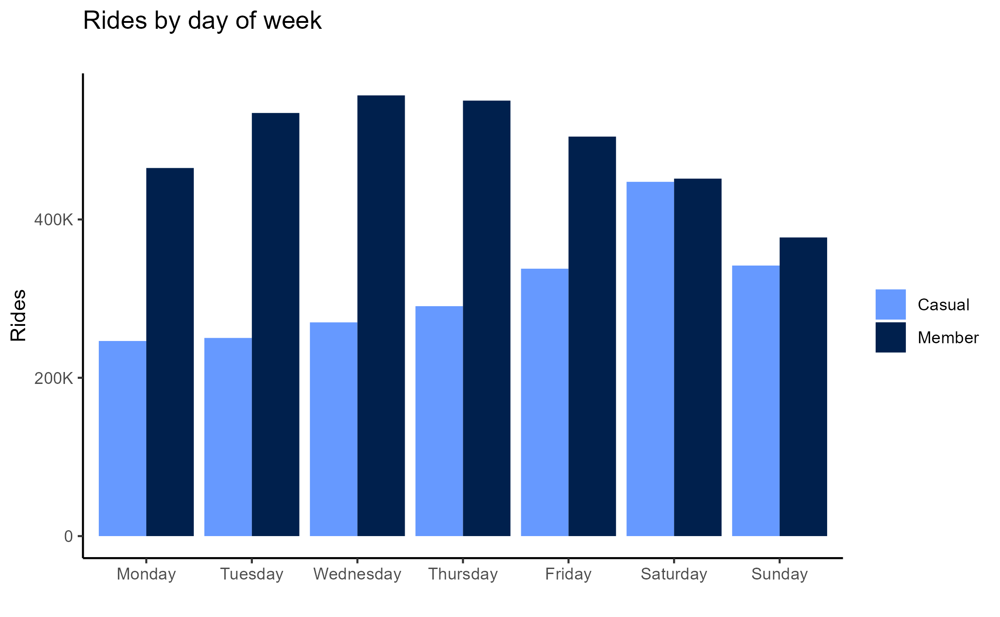

## Rides by Time of Day

When we view the number of rides by time of day we can see that the
afternoon (12pm - 6pm) is the most popular time to ride for both groups.
Casuals appear to ride less in the morning but proportionately more than
members at night (12am - 6am) when they ride nearly as much as members
but account for a smaller percentage of total rides.

``` r
ggplot(data) +
  aes(x = factor(phase_of_day, level=c("Morning", "Afternoon", "Evening", "Night")), fill = member_casual) +
  geom_bar(position = "dodge") +
  scale_y_continuous(label = label_number(scale_cut = cut_short_scale())) +
  scale_fill_manual(values = c(Casual = color_casual, Member = color_member)) +
  labs(x = "", y = "Rides", title = "Rides by Time of Day", subtitle = "") +
  theme_classic() +
  theme(legend.title = element_blank()) 
  ggsave("img/rides-by-time-of-day.png")
```

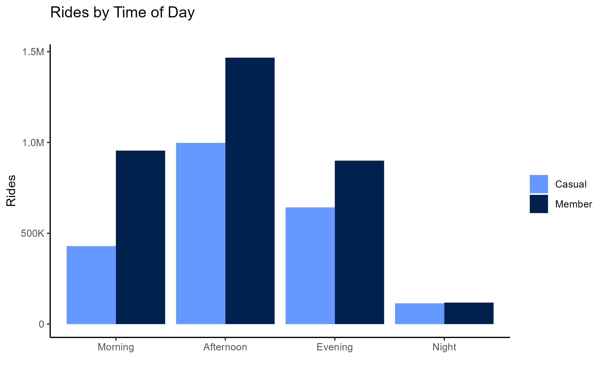

## Avgerage Ride Length by Time of Day

When visualizing ride length by time of day we can see that casual
riders ride longer on average throughout the day but also that both
groups ride longest during the afternoon while taking the shortest rides
on average at night.

``` r
data %>% 
  group_by(phase_of_day, member_casual) %>%
  summarise(
    avg_ride = mean(as.numeric(ride_length), na.rm = T),
    .groups = 'drop'
  ) %>% 
  ggplot() +
    aes(x = factor(phase_of_day, level=c("Morning", "Afternoon", "Evening", "Night")), y = avg_ride, fill = member_casual) +
    geom_bar(position='dodge', stat='identity') +
    scale_fill_manual(values = c(Casual = color_casual, Member = color_member)) +
    geom_text(aes(label= round(avg_ride, 1)), vjust = -0.5, size = 3.5, position = position_dodge(0.9)) +
    labs(x = "", y = "Average Ride Length (Minutes)", title = "Average Ride Length by Time of Day", subtitle = "") + 
    theme_classic() +
    theme(legend.title = element_blank())
    ggsave("img/avg-ride-length-by-time-of-day.png")
```

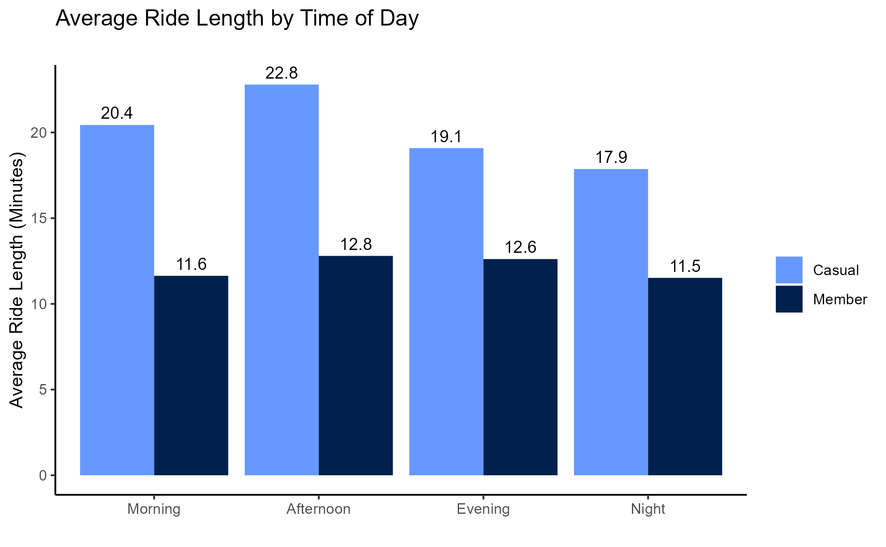

## Ride density maps

Ride density comparisons illustrate a similar ride density distribution
pattern for both members and casuals throughout the city overall. While
members show a higher density of ridership in the downtown area, casuals
show higher densities of ridership in some portions of the south side of
Chicago.

``` r
stns <- data %>% 
  drop_na(start_station_name, start_station_lat, start_station_lng, member_casual) %>% 
  group_by(start_station_name, member_casual) %>%
  summarise(
    rides = n(), 
    start_station_lat = mean(start_station_lat, na.rm = T),
    start_station_lng = mean(start_station_lng, na.rm = T),
    .groups = 'drop'
  ) %>%
  arrange(desc(rides))

# set bounding box and import map
bbox = c(top = 42.05, right = -87.4, bottom = 41.65, left = -88)
import_map <- get_map(bbox, maptype = "terrain", source = "stamen", zoom = 11)

# plot map
ggmap(import_map) +
  geom_density_2d_filled(data = stns, mapping = aes(x = start_station_lng, y = start_station_lat), color = "black", alpha = 0.55) +
  labs(title = "Ride density", caption = "", x = "", y = "") +
  facet_wrap(vars(member_casual)) + 
  theme( axis.text.x = element_blank(),
    axis.text.y = element_blank()
  )
  ggsave("img/ride-density-maps-2.png")
```

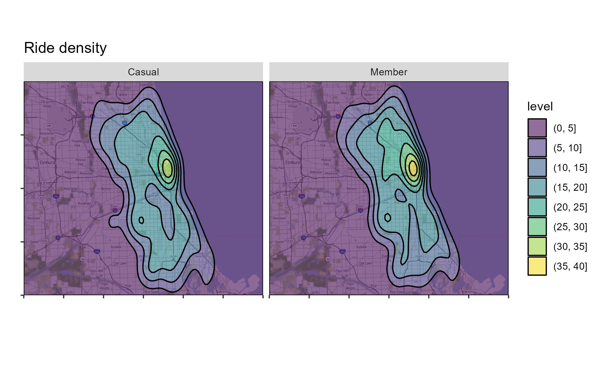

## Top 10 starting stations for members and casuals

A look at the most popular stations reveals key differences in behavior
between members and casuals. While the top ten start stations among
casual riders hugs the Lake Michigan shoreline, the most popular
stations for members are just a few blocks to the west. Pair this
pattern along with the weekly riding patterns of each group and we start
to see a key trend:

Casual riders are most active on the weekend near Chicago’s shoreline
parks while member riders tend to be most active during the workweek
just a few blocks to the west.

``` r
# top member stations
top_stations_members <- data %>% 
  select(member_casual, start_station_name, start_station_lat, start_station_lng) %>% 
  drop_na(start_station_name) %>% 
  filter(member_casual == "Member") %>%
  group_by(member_casual, start_station_name, start_station_lat, start_station_lng) %>% 
  summarise(
    Rides = n(), 
    .groups = 'drop'
  ) %>%
  arrange(desc(Rides)) %>% 
  head(10)

# top casual stations
top_stations_casuals <- data %>% 
  select(member_casual, start_station_name, start_station_lat, start_station_lng) %>% 
  drop_na(start_station_name) %>% 
  filter(member_casual == "Casual") %>%
  group_by(member_casual,start_station_name, start_station_lat, start_station_lng) %>% 
  summarise(
    Rides = n(), 
    .groups = 'drop'
  ) %>%
  arrange(desc(Rides)) %>% 
  head(10)


# set bounding box and import map
bbox = c(top = 41.9825, right = -87.5, bottom = 41.75, left = -87.9002)
import_map <- get_map(bbox, maptype = "terrain", source = "stamen", zoom = 11)

# plot map
ggmap(import_map) +
  geom_point(data = top_stations_members, mapping = aes(x = start_station_lng, y = start_station_lat, size = Rides, color = member_casual), alpha = 0.75) +
  geom_point(data = top_stations_casuals, mapping = aes(x = start_station_lng, y = start_station_lat, size = Rides, color = member_casual), alpha = 0.75) +
  labs(x="Longitude", y="Latitude", title = "Top 10 starting stations for members and casuals", caption = "") + 
  scale_color_manual(values=c(color_casual, color_member), name="Rider Type") +
  theme_bw() +
  theme(plot.title = element_text(size = 13.5))
  ggsave("img/top-10-start-stations-for-members+casuals-2.png")
```

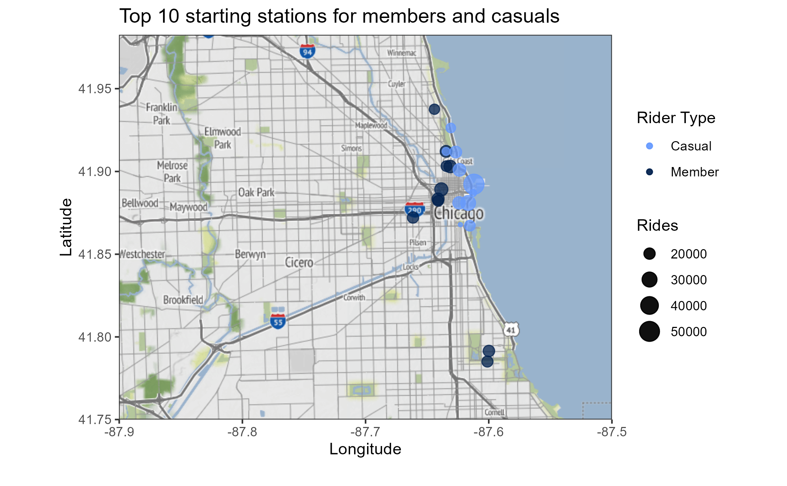

## Top 10 routes most frequently traveled by members

The most frequently traveled routes by members represent the most
popular starting and ending station combinations for member riders.

``` r
data %>% 
  select(start_station_name, end_station_name, member_casual) %>% 
  drop_na(start_station_name, end_station_name, member_casual) %>% 
  filter(member_casual == "Member", !start_station_name == "", !end_station_name == "", !member_casual == "") %>%
  mutate(route = paste(start_station_name, "  -\n", end_station_name)) %>% 
  count(subscription = member_casual, route) %>% 
  arrange(desc(n)) %>% 
  head(10) %>% 
  ggplot() +
  geom_bar(aes(x = reorder(route, n), y = n), fill = color_member, stat = "identity") +
  coord_flip() +
  labs(x = "", y = "Rides", title = "Routes most frequently traveled by members", subtitle = "") + 
  theme_classic() +
  theme(legend.title = element_blank())
  ggsave("img/top-10-routes-most-frequently-traveled-by-members.png")
```

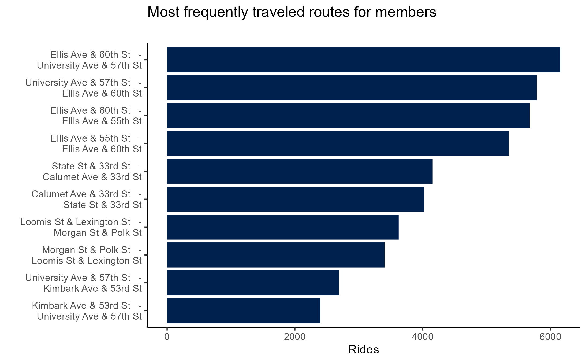

## Map of top 10 routes most frequently traveled by members

By plotting the coordinates of the most frequently traveled routes by
members we see another key trend arise:

The most frequently traveled routes by members all reside on or near
college campuses.

``` r
# popular Routes
popular_routes <- data %>% 
  select(start_station_name, end_station_name, member_casual, start_station_lat, start_station_lng, end_station_lat, end_station_lng) %>% 
  drop_na(start_station_name, end_station_name, member_casual) %>% 
  filter(member_casual == "Member") %>%
  mutate(route = paste(start_station_name, "  - \n", end_station_name)) %>% 
  count(subscription = member_casual, route, start_station_name, start_station_lat, start_station_lng, end_station_name, end_station_lat, end_station_lng) %>% 
  arrange(desc(n)) %>% 
  head(10)

# set bounding box and import map
bbox = c(top = 41.95, right = -87.35, bottom = 41.72, left = -87.7275)
import_map <- get_map(bbox, maptype = "terrain", source = "stamen", zoom = 11)

# plot map
ggmap(import_map) +
  geom_point(data = popular_routes, mapping = aes(x = start_station_lng, y = start_station_lat, size = n), color = color_member, alpha = 0.45) +
  geom_point(data = popular_routes, mapping = aes(x = end_station_lng, y = end_station_lat, size = n), color = color_member, alpha = 0.1) +

  geom_text(mapping = aes(x = -87.5, y = 41.794), label = "University of Chicago", size = 4, color = "#333333") +
  geom_text(mapping = aes(x = -87.515, y = 41.8358), label = "Illinois Inst of Technology", size = 4, color = "#333333") +
  geom_text(mapping = aes(x = -87.545, y = 41.871), label = "Univ of Illinois at Chicago", size = 4, color = "#333333") +

  labs(x="Longitude", y="Latitude", title = "Routes most frequently traveled by members", caption = "", size="Rides") + 
  theme_bw() +
  theme(plot.title = element_text(size = 13.5))
  ggsave("img/map-of-top-10-routes-most-freq-trav-members-2.png")
```

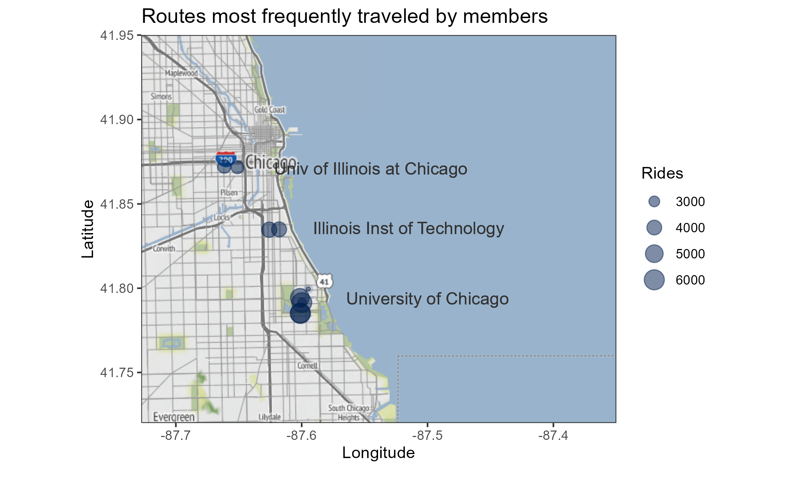

## Top 10 routes most frequently traveled by casuals

The most frequently traveled routes by casuals represent the most
popular starting and ending station combinations for casual riders. The
most popular ride by casuals both starts and ends at Streeter Dr. &
Grand Ave.

``` r
data %>% 
  select(start_station_name, end_station_name, member_casual) %>% 
  drop_na(start_station_name, end_station_name, member_casual) %>% 
  filter(member_casual == "Casual", !start_station_name == "", !end_station_name == "", !member_casual == "") %>%
  mutate(route = paste(start_station_name, "  - \n", end_station_name)) %>% 
  count(subscription = member_casual, route) %>% 
  arrange(desc(n)) %>% 
  head(10) %>%
  ggplot() +
  geom_bar(aes(x = reorder(route, n), y = n), fill = color_casual, stat = "identity") +
  coord_flip() +
  labs(x = "", y = "Rides", title = "Most frequently traveled routes for Casuals", subtitle = "") + 
  theme_classic() +
  theme(legend.title = element_blank())
  ggsave("img/top-10-routes-most-frequently-traveled-by-casuals.png")
```

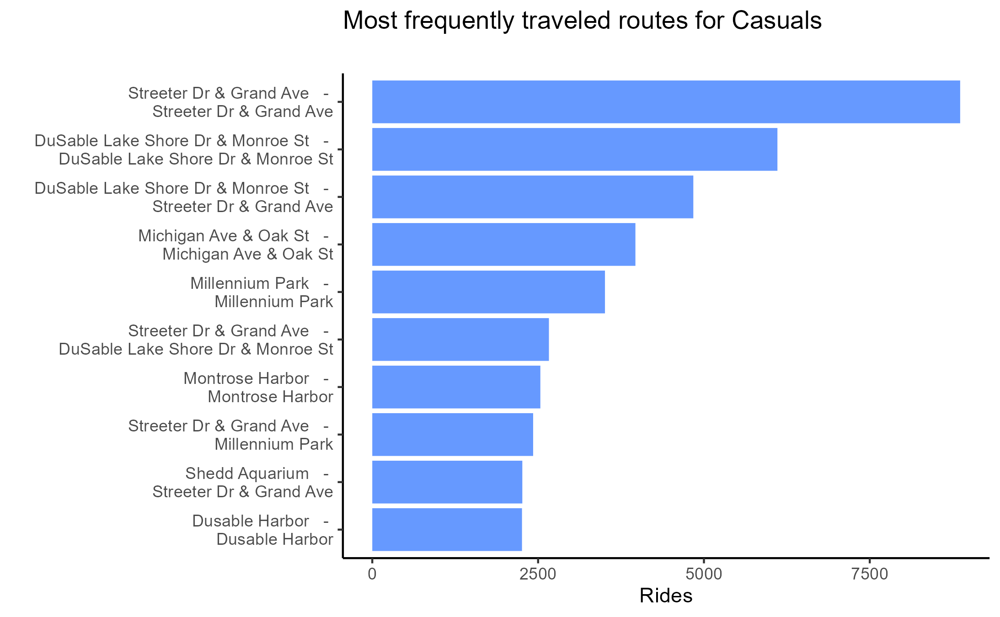

## Map of top 10 most frequently traveled routes by Casuals

The routes most frequently traveled by casual riders tend to be
clustered in and around Chicago’s shoreline parks.

``` r
# popular Routes
popular_routes <- data %>% 
  select(start_station_name, end_station_name, member_casual, start_station_lat, start_station_lng, end_station_lat, end_station_lng) %>% 
  drop_na(start_station_name, end_station_name, member_casual) %>% 
  filter(member_casual == "Casual") %>%
  mutate(route = paste(start_station_name, "  - \n", end_station_name)) %>% 
  count(subscription = member_casual, route, start_station_name, start_station_lat, start_station_lng, end_station_name, end_station_lat, end_station_lng) %>% 
  arrange(desc(n)) %>% 
  head(10) 

bbox = c(top = 41.9825, right = -87.5, bottom = 41.75, left = -87.9002)
import_map <- get_map(bbox, maptype = "terrain", source = "stamen", zoom = 11)

# plot map
ggmap(import_map) +
  geom_point(data = popular_routes, mapping = aes(x = start_station_lng, y = start_station_lat, size = n), color = color_member, alpha = 0.45) +
  geom_point(data = popular_routes, mapping = aes(x = end_station_lng, y = end_station_lat, size = n), color = color_member, alpha = 0.1) +
  labs(x="Longitude", y="Latitude", title = "Routes most frequently traveled by casuals", caption = "", size='Rides') + 
  theme_bw() +
  theme(plot.title = element_text(size = 13.5))
  ggsave("img/map-of-top-10-most-frequently-traveled-routes-by-casuals-2.png")
```

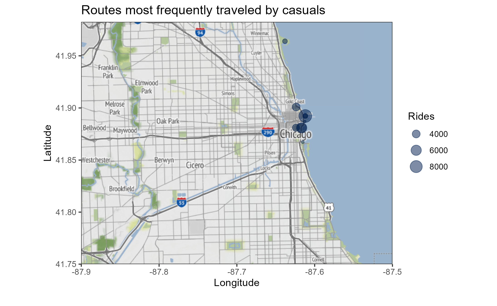

# Conclusions

1)  Casual rides are fewer than member rides and last more than 8
    minutes longer per ride on average than member rides.

2)  Casual riders ride more often on the weekends near Chicago’s
    shoreline parks while member riders tend to be most active during
    the workweek several blocks from the shoreline.

3)  The most frequently traveled routes by members occur on and around
    college campuses while the most frequently traveled routes for
    casual riders are clustered in and around Chicago’s shoreline parks.

# Top 3 Recommendations

1)  Encourage casual riders to convert to an annual membership by
    highlighting the cost savings involved in riding more often.
    Cyclistic’s network of 1000+ bike stations makes it easy to ride for
    a variety of tasks such as recreation, school and work - anywhere in
    the Chicago area.

2)  Target advertising toward high densities of casual riders in
    Chicago’s shoreline parks and ramp up advertising during the month
    of March when the anticipation of increased ridership is high.

3)  Gather more data by conducting a survey. Ask cyclistic riders: Why
    have you chosen Cyclistic for your mobility needs? What tasks do you
    perform when using Cylistic bikes? What do you like or dislike about
    Cyclistic?
